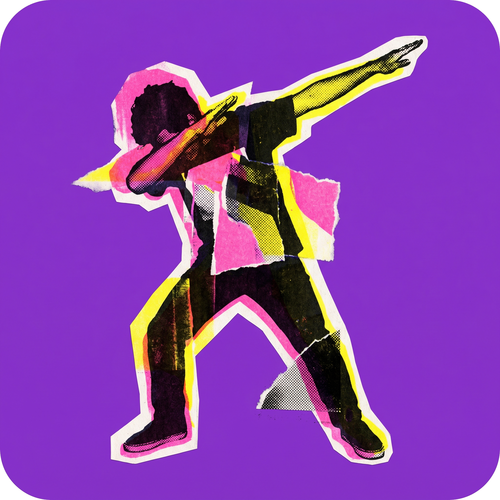

<div align="center">



### Real-time dab detection. Reaction speed game in the browser.

[](https://dabpose.fun)
[](https://nextjs.org)
[](https://react.dev)
[](https://www.typescriptlang.org)
[](https://google.github.io/mediapipe/)
[](#license)

</div>

---

## What is this

Open your webcam. Wait for the signal. **Dab as fast as you can.** Pose detection times your reaction down to the millisecond.

Two modes:

| Mode | Goal | Scoring |
|---|---|---|
| **Reflex Dab** | Fastest dab after the signal | lowest `time_ms` wins |
| **Dab Rush** | Most dabs in 30 seconds | highest `count` wins |

Built on MediaPipe Holistic — 33 pose landmarks tracked at ~30 FPS, fully client-side. Nothing leaves the browser except your score.

---

## Features

- **Real-time pose detection** — MediaPipe Holistic WASM, lazy-loaded from CDN
- **Frame-perfect timing** — `performance.now()` for sub-ms reaction measurement
- **Anti-cheat** — 3-frame confirmation + arm-raised early-start detection
- **Global leaderboards** — all-time / week / today windows, separate per mode
- **King Dab crown** — rank #1 gets the throne treatment
- **Auth & profiles** — Google sign-in, public profile pages, rename support
- **Country flags** — pick your flag per play, per-country leaderboards
- **Mobile-first** — fullscreen camera, works on phones with a front cam
- **PWA-ready** — installable, offline shell, theme color

---

## Tech stack

**Frontend** Next.js 15 (App Router, Turbopack) · React 19 · TypeScript · Tailwind CSS v4 · Framer Motion
**Pose** MediaPipe Holistic (WASM, `0.5.1675471629` pinned)
**Backend** Next.js Route Handlers · Upstash Redis (sorted sets) · Neon Postgres (Drizzle ORM)
**Auth** Auth.js v5 (NextAuth) — Google OAuth
**Infra** Vercel · Upstash Ratelimit · Vercel WAF (custom rules)
**Tests** Playwright (smoke + e2e)

---

## Quick start

```bash
git clone https://github.com/ItzMekh/dab-pose.git
cd dab-pose
npm install
cp .env.example .env.local   # fill in keys (see below)
npm run dev                  # → http://localhost:3000
```

### Required env vars

```env
UPSTASH_REDIS_REST_URL=
UPSTASH_REDIS_REST_TOKEN=
DATABASE_URL=                  # Neon Postgres
AUTH_SECRET=                   # openssl rand -base64 32
AUTH_GOOGLE_ID=
AUTH_GOOGLE_SECRET=
NEXTAUTH_URL=http://localhost:3000
```

> Server-side only — **no** `NEXT_PUBLIC_` prefix on Redis/DB keys.

### Scripts

```bash
npm run dev      # dev server (Turbopack)
npm run build    # production build
npm run lint     # ESLint flat config
npm run test     # Playwright e2e (needs dev server on :3000)
```

---

## Architecture

```
page.tsx
  └─ browser-compat gate (useBrowserCompat)
      └─ GameScreen (lazy, ssr: false, ErrorBoundary)
          ├─ CameraFeed     ── MediaPipe Holistic ─→ DabDetector
          ├─ GameTimer      ── random delay + anti-cheat
          ├─ StreakHUD      ── 30s timer + counter
          └─ ResultScreen   ── /api/score → leaderboard
```

**State machine** (`src/lib/game-state.ts`) — all transitions go through `transition(from, to)`:

```
IDLE → COUNTDOWN → WAITING → SIGNAL → DETECTED → RESULT → IDLE
                       └──────────→ FALSE_START ─────────→ IDLE
```

**Detection** — `DabDetector` needs 3 consecutive confirmed frames. Uses elbow angles + wrist-to-nose distance. A single negative frame resets the counter.

**Leaderboard** — Redis sorted sets, 1 `ZRANGE` per request, `s-maxage=30` cache. Score writes pipeline 3× `ZADD` + 2× `EXPIRE` + `INCR` in one round trip.

---

## Project structure

```
src/
├── app/
│   ├── api/              # score, leaderboard, stats, auth, profile
│   ├── leaderboard/      # public rankings
│   ├── profile/[name]/   # user pages
│   └── page.tsx          # landing + game entry
├── components/
│   ├── GameScreen.tsx    # main game container
│   ├── CameraFeed.tsx    # MediaPipe loop
│   ├── GameTimer.tsx     # countdown + signal
│   └── ResultScreen.tsx  # post-play submit
├── hooks/                # useBrowserCompat, useUsername, useCountry, ...
└── lib/
    ├── dab-detector.ts   # pose → dab decision
    ├── game-state.ts     # state machine
    ├── redis.ts          # Upstash client
    └── api.ts            # client → /api/score
```

---

## Contributing

Issues and PRs welcome → [github.com/ItzMekh/dab-pose/issues](https://github.com/ItzMekh/dab-pose/issues)

---

## License

MIT © [ItzMekh](https://github.com/ItzMekh)

<div align="center">

**[Play Dab Pose →](https://dabpose.fun)**

</div>
